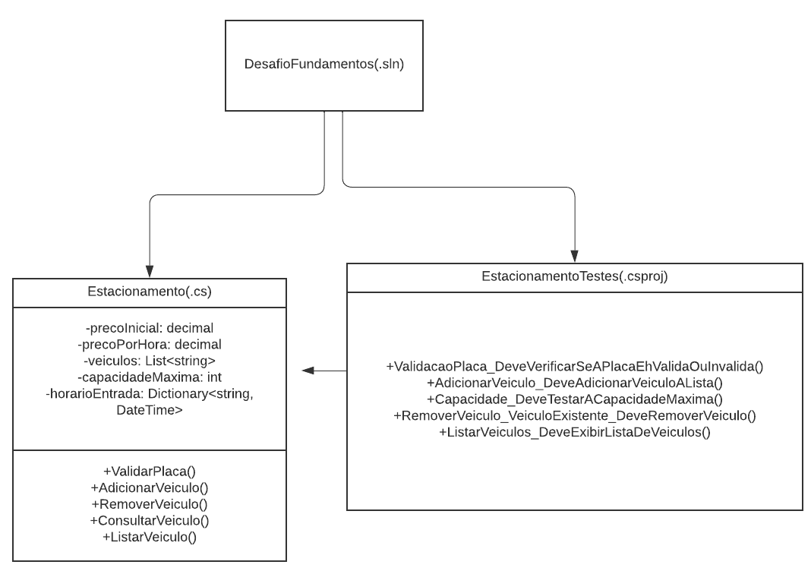

# DIO - Trilha .NET - Fundamentos
www.dio.me

## Desafio de projeto
Para este desafio, você precisará usar seus conhecimentos adquiridos no módulo de fundamentos, da trilha .NET da DIO.

## Contexto
Você foi contratado para construir um sistema para um estacionamento, que será usado para gerenciar os veículos estacionados e realizar suas operações, como por exemplo adicionar um veículo, remover um veículo (e exibir o valor cobrado durante o período) e listar os veículos.

## Proposta do Bootcamp
Você precisará construir uma classe chamada "Estacionamento", conforme o diagrama abaixo:

A classe contém três variáveis, sendo:

**precoInicial**: Tipo decimal. É o preço cobrado para deixar seu veículo estacionado.

**precoPorHora**: Tipo decimal. É o preço por hora que o veículo permanecer estacionado.

**veiculos**: É uma lista de string, representando uma coleção de veículos estacionados. Contém apenas a placa do veículo.

A classe contém três métodos, sendo:

**AdicionarVeiculo**: Método responsável por receber uma placa digitada pelo usuário e guardar na variável **veiculos**.

**RemoverVeiculo**: Método responsável por verificar se um determinado veículo está estacionado, e caso positivo, irá pedir a quantidade de horas que ele permaneceu no estacionamento. Após isso, realiza o seguinte cálculo: **precoInicial** * **precoPorHora**, exibindo para o usuário.

**ListarVeiculos**: Lista todos os veículos presentes atualmente no estacionamento. Caso não haja nenhum, exibir a mensagem "Não há veículos estacionados".

Por último, deverá ser feito um menu interativo com as seguintes ações implementadas:
1. Cadastrar veículo
2. Remover veículo
3. Listar veículos
4. Encerrar

## Solução
O código está pela metade, e você deverá dar continuidade obedecendo as regras descritas acima, para que no final, tenhamos um programa funcional. Procure pela palavra comentada "TODO" no código, em seguida, implemente conforme as regras acima.

## Melhorias Aplicadas

Foram realizadas algumas melhorias no projeto, entre elas, foram adicionados dois métodos a classe Estacionamento:

| Método          |    Objetivo                                                                                                                                                                                                                                    |
|-----------------|----------------------------------------------------------------------------------------------------------------------------------------------------------------------------------------------------------------------------------------------- |
| ValidarPlaca    |  Como seu nome já indica valida a placa indicada pelo usuário, verificando se possui 3 letras e 4 números.                                                                                                                                     |
| ConsultarVeiculo|  Consulta se o veiculo indicado pelo usuário consta na lista de veiculos, antes essa mesma função era realizada no método RemoverVeiculo, mas tive que fazer um método só para essa função para um melhor funcionamentos dos testes unitários. |

Adicionadas as seguintes variáveis:

| Variável             | Objetivo                                                                                                                                                                                                                                                                                                                         |
|----------------------|----------------------------------------------------------------------------------------------------------------------------------------------------------------------------------------------------------------------------------------------------------------------------------------------------------------------------------|
| capacidadeMaxima     | Trata-se de um private const int onde implementamos o número de veículos que o Estacionamento comporta.                                                                                                                                                                                                                          |
| horarioEntrada       | Trata-se de uma classe Dictionary privada que armazenará o horário de entrada do veículo no Estacionamento para que ao final seja cobrado o valor de forma automática considerando o valor da saída que também será dada de forma automática no momento do pedido de remoção do veículo, trazendo uma maior segurança ao sistema |

 E por fim, foi criada uma classe para testes unitários, esses testes englobam: 
 
| Teste                                                           | Objetivo:                                                                                                                                                      |
|-----------------------------------------------------------------|----------------------------------------------------------------------------------------------------------------------------------------------------------------|
|ValidacaoPlaca_DeveVerificarSeAPlacaEhValidaOuInvalida           | Testa o método "validarPlaca" onde inserimos uma placa válida e uma inválida e verificamos se o sistema retorna as ações esperadas.                            |
|AdicionarVeiculo_DeveAdicionarVeiculoALista                      | Testa o método "AdicionarVeiculo" onde iserimos um veículo para verificar se o sistema está respondendo da forma esperada.                                     |
|Capacidade_DeveTestarACapacidadeMaxima                           | Testa a variável "capacidadeMaxima" tentamos adicionar um veículo a mais do que a capacidade limite para verificar se o sistema manteria a capacidade fixada.  |
|RemoverVeiculo_VeiculoExistente_DeveRemoverVeiculo               | Testa o método "RemoverVeiculo" onde inserimos e depois removemos um veículo para testar se o sistema retornaria a ação esperada.                              |
|ListarVeiculos_DeveExibirListaDeVeiculos                         | Testa o método "ListarVeiculos" onde adicionamos alguns veículos e verificamos se foram adicionados a lista.                                                   |

Diagrama do sistema com as alterações descritas:

